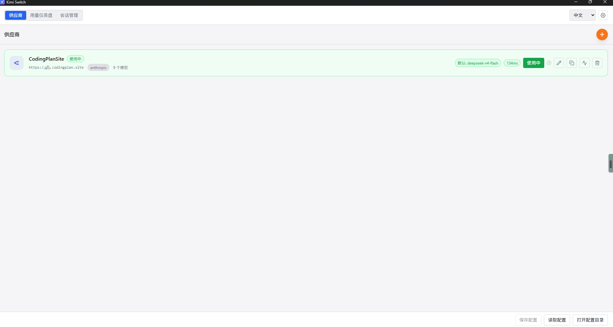
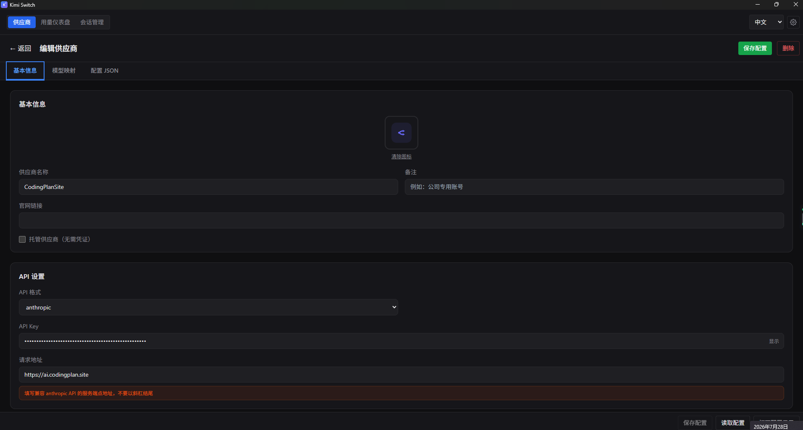
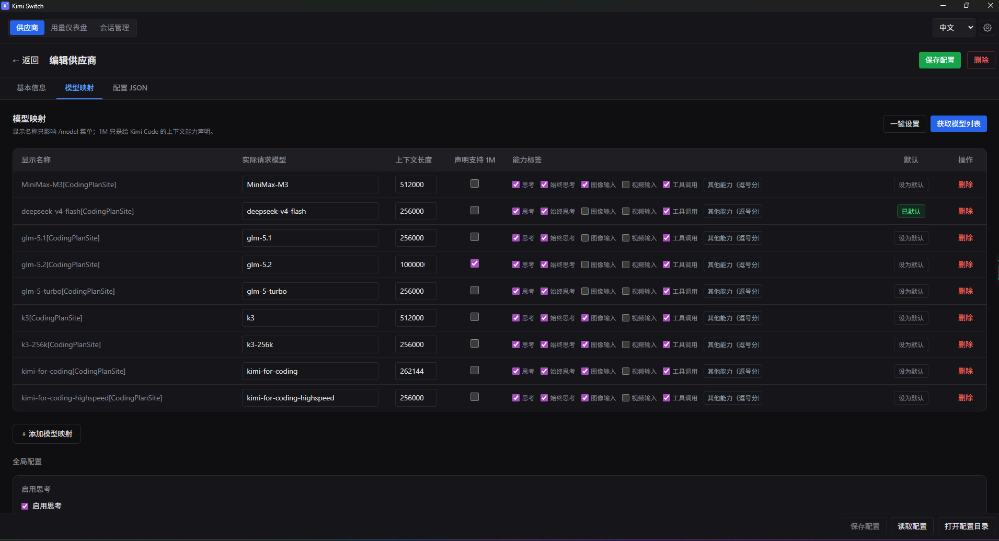
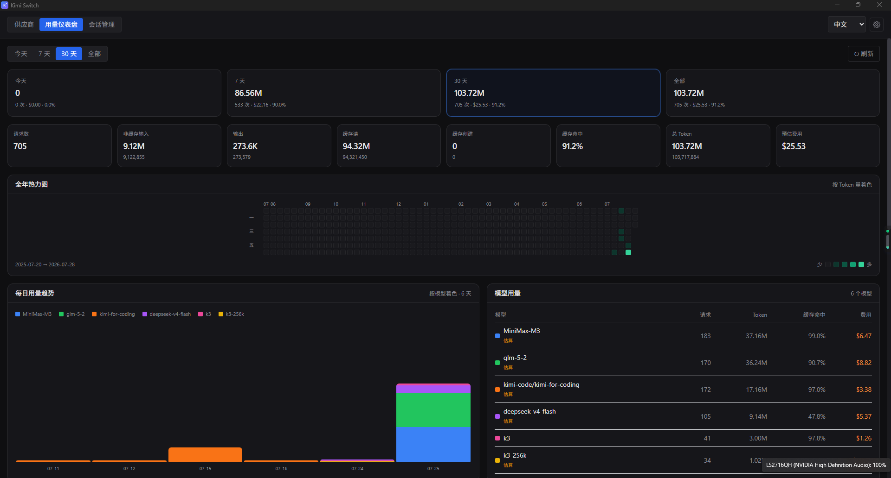
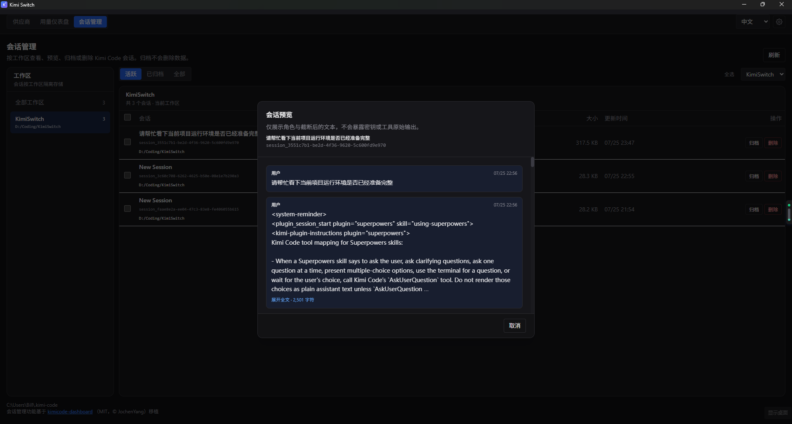

# Kimi Switch

> Windows 桌面端的 **Kimi Code CLI** 配置管理器——统一管理多家 LLM 供应商、模型、图标、连通性、用量统计与版本更新。

[English](./README_EN.md) | **中文**

[](https://tauri.app)
[](https://react.dev)
[](https://www.typescriptlang.org)
[](https://www.rust-lang.org)
[](https://github.com/billowliu2/KimiSwitch/releases/tag/v0.6.0)
[](./LICENSE)
[](https://github.com/billowliu2/KimiSwitch/releases/latest)

---

## 目录

- [这是什么](#这是什么)
- [核心特性](#核心特性)
- [界面预览](#界面预览)
- [架构总览](#架构总览)
- [功能详情](#功能详情)
- [支持的供应商类型](#支持的供应商类型)
- [数据存储位置](#数据存储位置)
- [快速上手](#快速上手)
- [开发指南](#开发指南)
- [键盘快捷键](#键盘快捷键)
- [国际化](#国际化)
- [测试](#测试)
- [打包发布](#打包发布)
- [发布历史](#发布历史)
- [常见问题](#常见问题)
- [已知限制与后续建议](#已知限制与后续建议)
- [安全提示](#安全提示)
- [致谢](#致谢)

---

## 这是什么

**Kimi Switch** 是一个为 [Kimi Code CLI](https://github.com/MoonshotAI/kimi-code) 用户打造的 Windows 桌面配置管理工具。它把 `~/.kimi-code/config.toml` 的手改工作搬到图形界面里，并补上一系列 CLI 自身没提供的便利：

- **多供应商统一管理**：Kimi / Anthropic / OpenAI / OpenAI Responses / Google GenAI / Vertex AI，一个界面搞定；新增的供应商会**自动提升到列表最前**，再切换不会覆盖丢失
- **模型一键发现**：根据供应商 API 自动拉取可用模型列表，模型显示名、上下文大小、能力等**优先取自 models.dev** 缓存（缺字段时再由后端/UI 兜底）
- **连通性测试**：参考 cc-switch 语义对 `base_url` 发 GET 请求，显示延迟气泡（绿/橙/红），6 秒自动消失
- **重复供应商**：一键深拷贝现有供应商及其模型，改 key 到 `xxx-copy` 即可二次定制
- **图标系统**：内置 100+ 主流供应商品牌图标，参考 cc-switch 实现；无匹配的供应商自动按命名规则生成首字母默认图标
- **用量仪表盘**：移植自 kimicode-dashboard，KPI / 热力图 / 按模型分色每日趋势 / 最近请求翻页
- **会话管理**：按工作区浏览、预览、归档、批量删除 Kimi Code 会话
- **版本更新**：进入应用时自动检测（可关闭），并支持一键下载安装
- **主题/语言切换**：设置面板中切换深色/浅色/跟随系统，简体中文/English
- **Windows 友好**：单实例；最小化保留任务栏按钮；关闭按钮隐藏到托盘

## 下载

- **Windows**: [GitHub Releases](https://github.com/billowliu2/KimiSwitch/releases/latest) → `.msi`
- **macOS**: [GitHub Releases](https://github.com/billowliu2/KimiSwitch/releases/latest) → `.dmg`（**未签名** —— 首次启动请右键 → 打开绕过 Gatekeeper）
- **Linux**: [GitHub Releases](https://github.com/billowliu2/KimiSwitch/releases/latest) → `.deb` / `.AppImage` / `.rpm`

历史版本（v0.5.x 及之前）请前往 [git.codingplan.site 仓库](https://git.codingplan.site/admin/KimiCodeSwitch/releases)。

构建说明请见 [`docs/BUILD.md`](./docs/BUILD.md)。

## 核心特性

| 分类 | 功能 |
| --- | --- |
| **多供应商** | Kimi / Anthropic / OpenAI / OpenAI Responses / Google GenAI / Vertex AI |
| **多 Agent** | 主目标 Kimi Code，Pi 代码保留但 UI 隐藏 |
| **图标系统** | 100+ 品牌图标 + 首字母默认图标；图标选择器按 brands / inference 分类 |
| **快捷切换** | 新增或激活的供应商自动提升到列表最前；切换只改 `default_model`，不丢其他供应商 |
| **连通性测试** | 实测 `base_url` 延迟，绿/橙/红彩色气泡，6 秒自动消失 |
| **重复供应商** | 一键深拷贝供应商 + 全部模型，key 改 `xxx-copy` |
| **图标按钮操作** | 启用 / 编辑 / 复制 / 测试连通 / 删除 全图标化（lucide-react） |
| **模型映射** | 别名（"provider/model" 形式）↔ 实际请求模型 ID，自定义显示名、上下文长度、1M 上下文声明、能力 |
| **自动上下文** | 拉取模型时 **API 返回 > models.dev ref > 正则兜底** 三级优先级自动适配 |
| **能力自动推导** | `image_in / video_in / tool_use` 全部由 models.dev 推得；UI 仅暴露 `thinking` 一个手动开关 |
| **全局设置** | `[thinking]` 表完整支持（enabled / effort / keep），仅 Kimi Code 生效 |
| **JSON 直编** | 高级用户可手动编辑完整配置 JSON，未知字段通过 `raw_other` 透传不丢 |
| **i18n / 主题** | 简体中文 / English；深色 / 浅色 / 跟随系统；设置持久化 |
| **自动备份** | 写入 `config.toml` 前自动备份，按时间戳命名，保留最近 7 天 |
| **快捷键** | Ctrl+S 保存、Ctrl+R 重载、Ctrl+O 打开配置目录 |
| **用量仪表盘** | 8 项 KPI、每日趋势（按模型分色堆叠）、全年热力图、最近请求翻页、双击柱状图查看模型分布 |
| **会话管理** | 按工作区浏览、归档/复活、批量删除；流式逐行预览（20MB 字节上限 + 500 字符折叠） |
| **版本更新** | 启动自动 + 每 8 小时周期 + 手动检查；下载进度条；下载完成后引导安装 |
| **未保存提示** | 关闭窗口前原生 `beforeunload` 提示 + 标题栏 `*` 前缀 |
| **窗口/托盘** | 最小化保留任务栏；关闭 X 隐藏到托盘；托盘左键始终显示并聚焦 |

## 界面预览

**供应商列表**（浅色主题）



展示当前激活的供应商、默认模型、延迟气泡、可用模型数量与品牌图标；支持快速切换、复制、测试连通、跳转官网、编辑、删除。

**编辑供应商 — 基本信息**



包括供应商名称、备注、官网链接、托管供应商开关、API 格式、API Key、请求地址。

**编辑供应商 — 模型映射**



一张表管理全部模型映射：显示名、实际请求模型、上下文长度、1M 上下文声明、能力（仅"思考"）、设为默认、删除。

**用量仪表盘**



8 项 KPI（请求数、非缓存输入、输出、缓存读/写/命中、总 Token、预估费用）+ 全年热力图 + 每日用量趋势（按模型分色堆叠柱状图，贴底布局）+ 模型用量明细 + 最近请求（分页）。

**会话管理**



按工作区隔离浏览 Kimi Code 会话，支持活跃/已归档/全部筛选；流式逐行预览（20MB 字节上限，500 字符折叠）；归档/取消归档/批量删除。

## 架构总览

```
┌────────────────────────────────────────────────────────────────────────┐
│                         Kimi Switch (Tauri v2)                          │
│                                                                        │
│   ┌──────────────────────────┐    ┌──────────────────────────────┐    │
│   │   React Frontend (TS)    │    │   Rust Backend (lib.rs)      │    │
│   │                          │    │                              │    │
│   │   src/App.tsx            │    │   src-tauri/src/             │    │
│   │   src/components/        │◄──►│     ├── lib.rs               │    │
│   │     ProviderList         │    │     ├── main.rs              │    │
│   │     ProviderEdit         │    │     ├── commands.rs          │    │
│   │     AgentSettingsPanel   │    │     ├── db.rs                │    │
│   │     SettingsModal        │    │     ├── kimi_code_io.rs      │    │
│   │     ProviderIcon /       │    │     ├── pi_io.rs (legacy)    │    │
│   │     IconPicker            │    │     ├── config_io.rs         │    │
│   │     dashboard/           │    │     ├── models.rs            │    │
│   │     sessions/            │    │     ├── validators.rs        │    │
│   │   src/hooks/             │    │     ├── dashboard.rs         │    │
│   │     useConfig / Dashboard│    │     └── profile_manager.rs   │    │
│   │     / Sessions / Theme   │    │                              │    │
│   │     / UpdateCheck        │    │                              │    │
│   │   src/lib/               │    │                              │    │
│   │     models-dev.ts        │    │                              │    │
│   │     model-defaults.ts    │    │                              │    │
│   │     agent-settings.ts    │    │                              │    │
│   │   src/icons/             │    │                              │    │
│   │     brands / inference / │    │                              │    │
│   │     extracted (cc-switch)│    │                              │    │
│   │   src/i18n/{zh,en}.ts    │    │                              │    │
│   │   src/types/{...}        │    │                              │    │
│   └──────────────────────────┘    └──────────────────────────────┘    │
│                  │                                  │                  │
└──────────────────┼──────────────────────────────────┼──────────────────┘
                   │                                  │
                   ▼                                  ▼
        ┌──────────────────────┐      ┌──────────────────────────┐
        │  SQLite              │      │  Agent 原生配置           │
        │  ~/.kimi-switch/      │      │  ├─ ~/.kimi-code/        │
        │    kimi-switch.db     │      │  │  └─ config.toml       │
        │  (元数据 + 兜底)      │      │  └─ ~/.pi/agent/         │
        │  + localStorage       │      │     ├─ models.json       │
        │   (主题/语言/检查)    │      │     └─ settings.json     │
        └──────────────────────┘      └──────────────────────────┘
                                              ▲
                                              │
                                  ┌──────────────────────────────┐
                                  │  models.dev 快照（前端）      │
                                  │  src/lib/models-dev.json      │
                                  │  + 脚本 scripts/fetch-models- │
                                  │    dev.mjs（可选定时刷新）    │
                                  └──────────────────────────────┘
```

**关键设计**：

- **`config.toml` 是 Kimi Code 的权威来源**：所有供应商和模型始终全量保留，`default_model` 决定哪个生效（与 CLI 原生 `/provider` 行为一致）。切换时只改 `default_model`，新增的供应商会被自动提升到列表最前，不会被覆盖
- **SQLite 只存 Kimi Switch 专有元数据**：备注、官网、每个 Agent 记住的默认模型（`settings` 表）。主题 / 语言 / 上次更新检查时间存在前端 `localStorage`（WebView2），不在 `~/.kimi-switch` 下。`config.toml` 不完整时 SQLite 兜底
- **`raw_other` 透传未知字段**：含 `[oauth]` 段，前后往返不丢字段
- **models.dev 快照**：来源于 `https://models.dev/api.json`，本地 JSON 缓存 → `capabilitiesFromRef` 推导 `thinking/image_in/video_in/tool_use`，`getModelRef` 推导 `max_context_size/display_name`；仪表盘成本计算以快照 `cost`（$/M tokens）为准，缺失时回退内置 Kimi 价格表（`pretauri` 钩子保证打包前自动同步）
- **启动版本与配置目录**：`KIMI_CODE_HOME` / `PI_CODING_AGENT_DIR` 覆盖 Kimi Code / Pi 的目录；Kimi Switch 自己的数据目录固定为 `~/.kimi-switch`，暂无环境变量覆盖（详见 [数据存储位置](#数据存储位置)）

## 功能详情

### 供应商优先级与切换

- **新增/激活自动提升到列表最前**：添加或切换供应商时会把它移到 `db.providers` 排序的第一位，UI 直接渲染最新顺序
- **切换只改 `default_model`**：所有供应商写入 `config.toml`，但只有被切换的成为 `default_model`，与 Kimi Code CLI `/provider` 命令一致
- **不会覆盖丢失**：通过 `/provider` 在 CLI 端增/改/删的供应商，加载时以 `config.toml` 为准，下一次保存时全部回写

### 图标系统

- 来自 cc-switch 的 `src/icons/extracted/` 库（100+ 主流供应商品牌图标）
- 找不到精确匹配的供应商时，按命名规则生成**首字母默认图标**（例如 `kimi-code` → `K`，`deepseek-v4` → `D`）
- `IconPicker` 内置 brands / inference 分类筛选；选中的图标保存到 `provider.icon` 字段

### 连通性测试

- 调 Rust 端 `test_connectivity` 命令：GET `provider.base_url`，任何 HTTP 响应 = 可达
- 返回 `{ ok, latency_ms, status_code, error }`
- 前端以**彩色气泡**形式内联展示（绿/橙/红 + 毫秒），6 秒后自动消失
- 测速气泡位置在"使用中/切换"按钮之前，不挡眼

### 重复供应商

- 点击"复制"图标按钮 → 深拷贝供应商 + 全部模型
- `provider.name` 加 `-copy` 后缀，模型自动改 key 为 `xxx-copy`
- 立即持久化到 SQLite + `config.toml`，toast 提示

### 自动上下文与能力

- 拉取模型时 `max_context_size` 三级优先级：**API 响应 > models.dev ref > 正则兜底**
- models.dev ref → `capabilities = ["thinking","image_in","video_in","tool_use"]`（按字段真值选）
- UI 上**只暴露"思考"复选框**（其它能力自动写入但不便手动编辑——保持与 Kimi Code 语义一致：能力只追加不能移除）
- `always_thinking` 只能手动加（models.dev 推导不出来），但当前 UI 屏蔽；需要时改 `config.toml` 即可

### 能力 vs 思考开关

- **模型能力**（`capabilities`）= "能不能"：决定模型是否支持思考，没声明 `thinking` 即使全局开关开着也不生效
- **全局 `[thinking]`**（设置面板）= "要不要"：新会话默认开/关、强度（low/medium/high/max）、保留思考内容
- `always_thinking` 锁死为开，忽略全局开关
- 全局配置仅 Kimi Code 生效

### 用量仪表盘

- 8 项 KPI、每日趋势（按模型分色堆叠，**贴底布局**）、全年热力图（按 Token 量 5 级着色）、最近请求（30 条/页）
- 双击每日趋势柱状图 → 弹出 `DailyDetailModal` 显示每个模型的用量分布
- 数据源：`src-tauri/src/dashboard.rs` + `src/hooks/useDashboard.ts`

### 会话管理

- 按工作区隔离浏览 Kimi Code 会话，支持活跃/已归档/全部筛选
- 流式逐行预览（20MB 字节上限，500 字符折叠可展开）
- 归档 / 取消归档 / 批量删除
- 早期版本的"闪崩"已通过流式读取 + 限制解决

### 设置面板

- **主题**：深色 / 浅色 / 跟随系统（`useTheme`，持久化到前端 `localStorage`）
- **语言**：简体中文 / English
- **版本**：当前版本 + 上次检查时间
- **更新检查**：启动自动 + 每 8 小时周期 + 手动检查；下载带进度条；下载完成后引导安装

### 窗口与托盘

- **最小化**：保留任务栏按钮，不再被劫持到托盘
- **关闭按钮（X）**：`prevent_close` + `hide` → 隐藏到托盘而非退出
- **托盘菜单**：显示 / 退出
- **托盘左键**：始终 `show + unminimize + focus`（不再 toggle hide）
- **第二次启动**：`single_instance` 插件接住，回前台 + 聚焦

## 支持的供应商类型

| 类型 | 标识符 | 默认 base_url | 模型发现 | 凭证 |
| --- | --- | --- | --- | --- |
| Kimi | `kimi` | `https://api.openai.com/v1` | ✅ OpenAI 协议 | `KIMI_API_KEY` 或 `env.KIMI_API_KEY` |
| Anthropic | `anthropic` | — | ✅ `/v1/models` | `ANTHROPIC_API_KEY` 或 `env` |
| OpenAI | `openai` | `https://api.openai.com/v1` | ✅ `/models` | `OPENAI_API_KEY` 或 `env` |
| OpenAI Responses | `openai_responses` | `https://api.openai.com/v1` | ✅ `/models` | `OPENAI_API_KEY` 或 `env` |
| Google GenAI | `google-genai` | `https://generativelanguage.googleapis.com` | ✅ `/v1beta/models` | `GOOGLE_API_KEY` 或 `env` |
| Vertex AI | `vertexai` | — | ⚠️ 待实现 | `VERTEXAI_API_KEY` + `GOOGLE_CLOUD_PROJECT` + `GOOGLE_CLOUD_LOCATION` |

凭证优先级：`api_key` 字段 > `env` 表里的同名键。

## 数据存储位置

| 文件 | 用途 | 备份 |
| --- | --- | --- |
| `%USERPROFILE%\.kimi-switch\kimi-switch.db` | Kimi Switch 自己的 SQLite，存元数据（备注/官网/记住的默认模型 + 排序）+ 兜底 | — |
| `%USERPROFILE%\.kimi-code\config.toml` | Kimi Code CLI 的 TOML 配置（**权威数据源，切换/保存时写入**） | 同目录 `backups/config.toml.bak.{YYYYMMDD_HHMMSS}`，保留 7 天 |
| `%USERPROFILE%\.pi\agent\models.json` | Pi 的供应商+模型配置（**切换时写入**） | 同目录 `backups/models.json.bak.{YYYYMMDD_HHMMSS}`，保留 7 天 |
| `%USERPROFILE%\.pi\agent\settings.json` | Pi 的默认供应商/模型（**切换时写入**） | 同目录 `backups/settings.json.bak.{YYYYMMDD_HHMMSS}`，保留 7 天 |
| WebView2 `localStorage` | 前端状态：`kimi-switch-theme` / `kimi-switch-lang` / `kimi-switch-last-update-check` / `kimi-switch-agent` / `kimi-switch-dashboard-range`（主题 / 语言 / 上次更新检查 / 上次选中 Agent / 仪表盘时间范围） | — |
| `src/lib/models-dev.json` | models.dev `api.json` 快照（前端内置） | — |

环境变量覆盖：

- `KIMI_CODE_HOME` 覆盖 Kimi Code 配置目录（默认 `~/.kimi-code`）
- `PI_CODING_AGENT_DIR` 覆盖 Pi Agent 配置目录（默认 `~/.pi/agent`）
- Kimi Switch 自己的数据目录固定为 `~/.kimi-switch`，**暂无环境变量覆盖**

## 快速上手

### 前置依赖

| 工具 | 版本 | 说明 |
| --- | --- | --- |
| Node.js | ≥ 18 | 前端构建 |
| Rust | stable 最新版（edition 2021） | Tauri 后端编译 |
| WebView2 Runtime | Windows 10/11 默认已装 | Tauri v2 运行时 |
| Microsoft C++ Build Tools | 最新版 | Rust 编译依赖 |
| WiX Toolset 3.14 | `src-tauri/wix314-binaries/` | MSI 打包（首次构建自动下载） |

### 安装

```bash
npm install
```

### 开发模式（热重载）

```bash
npm run tauri-dev
```

同时启动 Vite 开发服务器（端口 1420）和 Tauri 窗口；前端热重载，Rust 自动重编译。

### 仅前端开发（无 Tauri 窗口）

```bash
npm run dev
```

适用于纯 UI 调试。

## 开发指南

### 项目结构

```
.
├── src/                              # React 前端
│   ├── App.tsx                       # 主组件，路由 ProviderList/ProviderEdit + 仪表盘/会话
│   ├── main.tsx                      # React 入口 + ErrorBoundary + I18nProvider
│   ├── components/
│   │   ├── ProviderList.tsx          # 供应商列表 + 切换 / 复制 / 测试连通 / 编辑 / 删除
│   │   ├── ProviderEdit.tsx          # 供应商编辑 + 模型映射 + JSON 直编 + 能力
│   │   ├── AgentSettingsPanel.tsx    # Kimi Code 全局设置（思考/循环/权限/钩子）
│   │   ├── SettingsModal.tsx         # 设置弹窗（主题 / 语言 / 版本 / 检查更新）
│   │   ├── ProviderIcon.tsx          # 供商品牌图标（带首字母兜底）
│   │   ├── IconPicker.tsx            # 图标选择器（brands / inference 分类）
│   │   ├── dashboard/                # 用量仪表盘
│   │   │   ├── DashboardPage.tsx
│   │   │   ├── DailyBars.tsx
│   │   │   ├── DailyDetailModal.tsx
│   │   │   └── Heatmap.tsx
│   │   └── sessions/                 # 会话管理
│   │       └── SessionsPage.tsx
│   ├── hooks/
│   │   ├── useConfig.ts              # 加载/保存配置
│   │   ├── useDashboard.ts           # 仪表盘数据
│   │   ├── useSessions.ts            # 会话数据
│   │   ├── useTheme.ts               # 主题切换
│   │   └── useUpdateCheck.ts         # 版本检查 + 下载
│   ├── lib/
│   │   ├── agent-settings.ts         # AgentSettings 解析/序列化
│   │   ├── model-defaults.ts         # 模型默认上下文大小
│   │   ├── models-dev.ts             # models.dev 快照查找 + 能力映射
│   │   ├── models-dev.json           # 内置快照
│   │   └── dashboard-format.ts       # 仪表盘格式化
│   ├── icons/
│   │   ├── brands.ts                 # 品牌图标入口
│   │   ├── inference.ts              # 推理服务图标
│   │   └── extracted/                # 来自 cc-switch 的图标库
│   │       ├── index.ts
│   │       └── metadata.ts
│   ├── types/
│   │   ├── index.ts                  # Provider/Model/Config
│   │   ├── dashboard.ts
│   │   ├── sessions.ts
│   │   └── icon.ts
│   ├── i18n/
│   │   ├── zh.ts                     # 中文翻译（源）
│   │   ├── en.ts                     # 英文翻译
│   │   └── index.tsx                 # useTranslation hook + Provider
│   └── index.css                     # Tailwind 入口
│
├── src-tauri/                        # Rust 后端
│   ├── src/
│   │   ├── lib.rs                    # Tauri Builder + 托盘 + 窗口事件 + invoke_handler
│   │   ├── main.rs                   # 二进制入口
│   │   ├── commands.rs               # ~14 个 Tauri Command
│   │   ├── db.rs                     # SQLite 持久化
│   │   ├── kimi_code_io.rs           # ~/.kimi-code/config.toml 读写
│   │   ├── pi_io.rs                  # ~/.pi/agent/*.json 读写（保留）
│   │   ├── config_io.rs              # 文件备份工具
│   │   ├── models.rs                 # Config/Provider/Model 数据结构
│   │   ├── profile_manager.rs        # 多 Profile 管理（占位）
│   │   ├── validators.rs             # 配置校验
│   │   └── dashboard.rs              # 会话/用量数据聚合
│   ├── capabilities/                 # Tauri 权限声明
│   ├── icons/                        # 应用图标（脚本生成）
│   └── tauri.conf.json               # Tauri 配置（窗口/打包/CSP）
│
├── scripts/
│   ├── fetch-models-dev.mjs          # 刷新 models-dev.json 快照
│   └── generate-icons.py             # 从 SVG 生成各尺寸图标
├── public/kimi.svg                   # 应用图标源（蓝紫渐变 π）
└── docs/
    ├── screenshots/                  # README 引用的界面截图
    └── superpowers/                  # 设计规范与实施计划
```

### Tauri Commands（前端 ↔ 后端）

| 命令 | 说明 |
| --- | --- |
| `load_agent_config_command(agent)` | 加载配置：Kimi Code 以 `config.toml` 为权威 + SQLite 补充；Pi 优先 SQLite |
| `save_agent_config_command(agent, config)` | 保存到 SQLite；Kimi Code 同时写入 `config.toml` |
| `activate_agent_config_command(agent)` | 全量写入 Agent 原生配置（Kimi Code 写全部供应商，`default_model` 决定生效项；Pi 仅写活跃供应商） |
| `open_agent_config_dir(agent)` | 打开 Agent 配置目录 |
| `get_app_version()` | 返回 `Cargo.toml` 版本号 |
| `list_provider_models(provider)` | 调供应商 API 拉取模型列表（异步，分页） |
| `test_connectivity(provider)` | GET `base_url` 测连通性，返回 `{ ok, latency_ms, status_code, error }` |
| `get_app_setting(key)` | 读取 App 设置（主题 / 语言 / 上次更新检查时间） |
| `set_app_setting(key, value)` | 写入 App 设置 |
| `check_for_update()` | 检查 GitHub releases，返回版本号 + 资产 URL |
| `download_update(url, path)` | 流式下载更新包，发 `download-progress` / `download-complete` 事件 |
| `open_installer(path)` | 用系统 shell 打开下载好的安装包 |
| `dashboard::get_paths()` / `get_prices()` / `get_summary()` / `list_sessions()` / `archive_session()` / `unarchive_session()` / `delete_session()` / `delete_workspace()` / `get_session_preview()` | 用量与会话相关 |
| `debug_log(message)` | 前端日志 → stderr（开发用） |

### 添加新供应商类型

1. `src-tauri/src/models.rs` 的 `ProviderType` 枚举加新变体
2. `default_base_url()` 加默认值
3. `commands.rs::list_provider_models` 的 `match` 加分发
4. `kimi_code_io.rs::provider_type_for_kimi_type` 加映射
5. `src/components/ProviderEdit.tsx` 的 API 格式下拉加选项
6. `src/i18n/{zh,en}.ts` 加 i18n 键

### 添加新 Tauri Command

1. `src-tauri/src/commands.rs` 加 `#[tauri::command]`
2. `src-tauri/src/lib.rs` 的 `tauri::generate_handler![...]` 注册
3. 前端 `import { invoke } from "@tauri-apps/api/core"` 调用
4. `src-tauri/capabilities/default.json` 加权限（如需文件/网络）

### 添加新模型能力

1. `src/components/ProviderEdit.tsx` 的 `KNOWN_CAPABILITIES` 加新键
2. `CAPABILITY_LABELS` 加 i18n 映射
3. `src/i18n/{zh,en}.ts` 加翻译
4. `src/lib/models-dev.ts` 的 `capabilitiesFromRef` 加推导（若可从 models.dev 推）

## 键盘快捷键

| 快捷键 | 作用 |
| --- | --- |
| `Ctrl + S` | 保存当前修改到 SQLite + `config.toml`（Kimi Code） |
| `Ctrl + R` | 重新读取配置（未保存时提示） |
| `Ctrl + O` | 打开当前 Agent 的配置目录 |

## 国际化

- 翻译源：`src/i18n/zh.ts`（源） + `src/i18n/en.ts`（目标）
- 新增 key **先在 `zh.ts` 里加**，`en.ts` 的 `Record<TranslationKey, string>` 类型会自动校验缺失条目（编译时报错）
- `useTranslation` hook 暴露 `{ t, lang, setLang }`
- 运行时切换由 `SettingsModal` 提供，持久化到前端 `localStorage`（`kimi-switch-lang`）

## 测试

### Rust 单元测试

```bash
cd src-tauri
cargo test
```

当前覆盖：

- `kimi_code_io::tests` — TOML 导入/导出往返
- `pi_io::tests` — JSON 往返，含 advanced fields（headers/compat/cost/extra）
- `validators::tests` — 配置校验
- `dashboard::tests` — 用量聚合与时区处理

### 前端

暂未自动化测试，建议手动验证清单：

- [ ] 切换供应商后默认模型正确回填
- [ ] 添加新供应商自动提升到列表最前
- [ ] 重复供应商生成的 key 不冲突
- [ ] 测试连通性气泡在 6 秒后自动消失
- [ ] 关闭 X 隐藏到托盘；最小化保留任务栏
- [ ] 主题切换（深色 / 浅色 / 跟随系统）即时生效
- [ ] 切换语言后 UI 文案立即更新
- [ ] 启动检查更新 → 下载 → 引导安装
- [ ] 拉取模型时 `max_context_size` 自动填充
- [ ] 切换供应商后 Kimi Code 会话经 `/reload` + `/model` 选回默认（或 `/exit` 重开会话）后生效

## 打包发布

```bash
npm run tauri-build
```

产物位置：

```
src-tauri/target/release/bundle/msi/Kimi Switch_<version>_x64_en-US.msi
```

Windows 安装包（MSI），含 WebView2 bootstrapper 自动下载。`nsis` 已禁用，目前只产 MSI。

### 首次打包

首次运行会下载：

- WiX Toolset 3.14 binaries → `src-tauri/wix314-binaries/`
- WebView2 bootstrapper → 打包进 MSI

### 常见构建问题

- **`os error 5`**（WiX light 步骤）：先 `taskkill //F //IM kimiswitch.exe` 杀掉占用进程后重试
- **prebuild 拉 models.dev 超时**：属正常，本地快照兜底不影响构建

## 发布历史

### v0.6.0（最新）

- **15 条主流供应商预设**：Kimi Coding / Moonshot / Anthropic / DeepSeek / 智谱 GLM / z.ai / 阿里百炼 / MiniMax / StepFun / SiliconFlow / Novita / OpenRouter / OpenAI / Google AI Studio / 火山方舟，通过 `PresetPickerModal` 一键填表
- **供应商余额 / 套餐查询**（卡片底部 `UsageFooter`）：余额类（DeepSeek / SiliconFlow / OpenRouter / StepFun / Novita）+ 套餐类（Kimi For Coding / 智谱 GLM / MiniMax），5min stale TTL + `force_refresh` + 并发 ≤3
- **Rust 端 `services/` 模块**（`balance` / `coding_plan` / `usage_types`），参考 cc-switch（MIT，© Jason Young）实现
- `query_provider_usage` 命令：Rust 端从 config 加载 key，不经 IPC 序列化 API key
- `usageKinds` 持久化到 SQLite settings（JSON 数组），load 时合并回 config，导出 `config.toml` 时不写
- `detect_provider` 启发式：旧用户升级后自动获得账单支持
- save-time 校验：未完成供应商（缺 api_key / base_url / 模型）保存时弹 confirm 列出原因；新增未提交 back 时静默 drop
- 修复：`handleDuplicateProvider` 的 `alias.slice` 漏洞；`handleSelectPreset` 不再 auto-save；`handleSwitchProvider` 校验取消时自动 refresh 回滚
- 新增文档：[`docs/PROPOSAL-presets-and-usage.md`](./docs/PROPOSAL-presets-and-usage.md)（v0.4-draft 实施档）、[`docs/VERIFICATION-CHECKLIST.md`](./docs/VERIFICATION-CHECKLIST.md)（70+ 项手动验证清单）

### 历史版本

v0.5.x 及之前版本（含 v0.5.1 / v0.5.0 / v0.4.1 / v0.4.0 / v0.3.0）请前往 [git.codingplan.site 仓库](https://git.codingplan.site/admin/KimiCodeSwitch/releases) 查看。GitHub 仓库仅作为 v0.6.0 及以后版本的发布渠道。

## 常见问题

**Q: 切换供应商后 Kimi Code 没生效？**
A: 需要分两步：
1. 在 Kimi Code 会话里执行 `/reload`，让 CLI 重新读取 `~/.kimi-code/config.toml`（此时模型**下拉列表**会刷新）；
2. **再执行一次 `/model` 选回新的默认模型**，或者直接 `/exit` 重开会话。

仅 `/reload` **不会**把新的 `default_model` 自动套用到当前会话——这是 Kimi Code 的已知行为，详见下方[已知限制与后续建议](#已知限制与后续建议)。应用会在 UI 上提示这两步。

**Q: 切换会覆盖其他供应商吗？**
A: 不会。Kimi Code 的 `config.toml` 始终写入全部供应商，仅 `default_model` 决定生效项。这与 CLI 原生 `/provider` 行为一致。

**Q: 新增/激活的供应商位置怎么变？**
A: 自动提升到列表最前，UI 立即反映。

**Q: 为什么能力只显示"思考"？**
A: Kimi Code 语义上 `capabilities` 只追加不能移除，models.dev 已有自动推导，再手动暴露只会增加误操作风险。需要声明 `always_thinking` 等特殊值时直接编辑 `config.toml` 即可。

**Q: 改了配置但忘了保存就关了窗口？**
A: 关闭窗口前有原生 `beforeunload` 提示，标题栏也会显示 `*` 前缀。

**Q: 怎么备份/迁移我的配置？**
A: 对 Kimi Code，`config.toml` 本身就是全量权威，直接备份即可；`kimi-switch.db` 存备注 / 官网 / 排序，迁移时一并备份。主题 / 语言 / 上次更新检查时间存在前端 `localStorage`（WebView2），不是独立文件，迁移时通常无需单独处理。

**Q: Vertex AI 为什么不能拉取模型列表？**
A: Vertex 需要 GCP project / location 凭证，当前实现留 TODO，等 GCP SDK 集成后补。

**Q: 支持 macOS / Linux 吗？**
A: 代码不依赖 Windows 专属 API，但 `tauri.conf.json` 的 bundle 目标目前只配了 `msi`。理论上把 `bundle.targets` 改成 `["app", "dmg"]` 等即可跨平台，但未验证。

**Q: 怎么改主题 / 语言？**
A: 顶部齿轮 → 设置弹窗 → 主题 / 语言。保存到前端 `localStorage`（WebView2），重启后保持。

**Q: 把窗口关了怎么再打开？**
A: 关闭按钮（X）已改为隐藏到托盘。点击托盘图标（菜单栏 / 系统托盘）即可拉回；点击任务栏图标正常切换最小化/还原。

**Q: 检查更新是怎么触发的？**
A: 启动时静默检查一次，之后每 8 小时自动检查一次（无网络时静默失败，不弹错）。也可手动：设置弹窗 → 版本 → 检查更新。下载有进度条，下载完成后会有"打开安装包"按钮。

## 已知限制与后续建议

### `/reload` 不会切换当前会话的默认模型（Kimi Code 上游限制）

**现象**：在 Kimi Switch 切换供应商后，`config.toml` 顶层的 `default_model` 已经被正确更新；回到 Kimi Code CLI 执行 `/reload`，模型**下拉列表**能列出新的默认模型，但**当前会话实际仍在使用旧模型**（底部状态栏显示的模型、真正发出的请求都没变）。

**根因**（已对照 Kimi Code 源码确认，不是 Kimi Switch 的 bug）：

- `/reload` 命令（`apps/kimi-code/src/tui/commands/reload.ts`）在刷新 `availableModels / availableProviders` 之后，**没有**把 `config.defaultModel` 重新套用到当前会话的 agent 上。
- 会话当前的模型（`agent.config.modelAlias`）来自会话创建时的 `options.model ?? config.defaultModel`（`packages/agent-core/src/rpc/core-impl.ts:438-440`），并通过 `records.logRecord` 持久化进会话日志；`Agent.resume()` 调 `records.replay()` 时会**回放这些历史记录**，从而把模型恢复成"上次手动选的"，而不是 `config.defaultModel`。
- 单元测试（`apps/kimi-code/test/tui/commands/reload.test.ts:87-89`）也只断言"模型列表刷新了"，没有任何"当前会话切到新默认模型"的断言——因为实现层就没做这一步。
- 全仓检索 `FOLLOW_DEFAULT / reloadDefault / KIMI_CODE_RELOAD` 等关键字**零命中**，说明 Kimi Code 目前**没有**任何"reload 时跟随 default_model"的开关。

**Workaround（当前可用）**：

1. `/reload` 后再执行 `/model`，手动选一次新默认模型；或
2. `/exit` 退出会话再重开（重新走 `createSession` 路径，会把 `config.defaultModel` 套到新会话）。

**建议反馈给 Kimi Code 上游的修复点**：

- 文件：`apps/kimi-code/src/tui/commands/reload.ts` 的 `handleReloadCommand`。
- 位置：`applyRuntimeConfig(host, config)` 之后，补一段把 `config.defaultModel` 同步到当前会话 agent 的逻辑，例如：
  ```ts
  const newDefault = config.defaultModel;
  const current = /* host.session 当前 agent 的 modelAlias */;
  if (newDefault && newDefault !== current) {
    await host.session.mainAgent.config.update({ modelAlias: newDefault });
  }
  ```
- 配套断言：在 `reload.test.ts` 增加对"reload 后会话当前模型 == 新 `defaultModel`"的测试，防回归。
- 可选增强：暴露一个会话级"follow default on reload"开关，或当会话旧 alias 已被删除时自动回退到 `default_model`。

> 注：以上建议**尚未提交给官方**，记录于此供后续跟进。Kimi Switch 侧只能保证 `config.toml` 写入正确，无法绕开 Kimi Code 自身的 `/reload` 语义。

### 其它后续建议（按优先级）

- **P1 — 模型别名规范**：早期裸名或 `-1/-2` 后缀的别名（如 `kimi-k3`、`glm-5-2-1`）已批量重命名为 `provider/model` 形式；新增供应商时建议**强制**采用规范命名，避免再出现补全后缀。可在保存前加一层 lint。
- **P1 — 用量趋势多维度**：用量趋势已支持"模型用量趋势 / 供应商模型用量趋势"两个 Tab；后续可考虑增加"按工作区"或"按 Token / 按费用"的第三维度切换。
- **P2 — 周期检查更新**：当前为启动 + 每 8 小时一次；后续可考虑做成可配置项（设置面板里设周期 / 关闭）。
- **P2 — 跨平台**：目前只产 MSI，代码不依赖 Windows 专属 API；待 Tauri v2 的 macOS/Linux bundle 配置后即可验证。
- **P3 — 配置校验增强**：`validators.rs` 当前偏基础，可补：`base_url` 合法性、`env` 与 `api_key` 互斥、`oauth` 段完整性。

## 安全提示

- API Key 明文存储在本地 SQLite 和 Agent 原生配置里——**不要在共享电脑上保存**
- 不要把 `kimi-switch.db`、`config.toml`、`models.json` 提交到 Git
- 应用 CSP 已收紧（`default-src 'self'`），但 WebView2 仍可能缓存表单内容，注意在公共电脑用完退出

---

## 致谢

用量仪表盘与会话管理功能基于 [kimicode-dashboard](https://github.com/JochenYang/kimicode-dashboard)（MIT 许可证，© JochenYang）移植。Rust 后端（`src-tauri/src/dashboard.rs`）、前端仪表盘（`src/components/dashboard/`）、会话管理页（`src/components/sessions/`）均源自该项目，感谢原作者的开源贡献。

供应商品牌图标资源（`src/icons/extracted/`）与图标选择器（`src/components/IconPicker.tsx`）参考自 [cc-switch](https://github.com/farion1231/cc-switch)（MIT 许可证，© Jason Young），感谢原作者的开源贡献。

供应商预设结构（`src/config/providerPresets.ts`）与余额/套餐查询实现（`src-tauri/src/services/`）同样参考自 [cc-switch](https://github.com/farion1231/cc-switch)（MIT 许可证，© Jason Young）。

---

许可证：MIT，详见 [LICENSE](./LICENSE)。Copyright (c) 2026 CodingPlan.site
